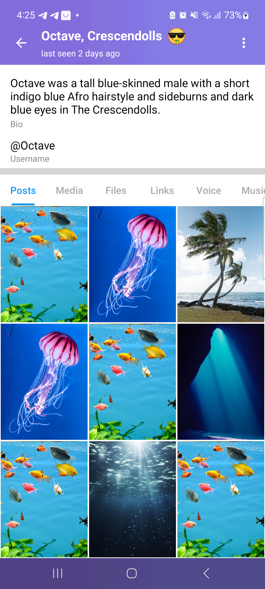
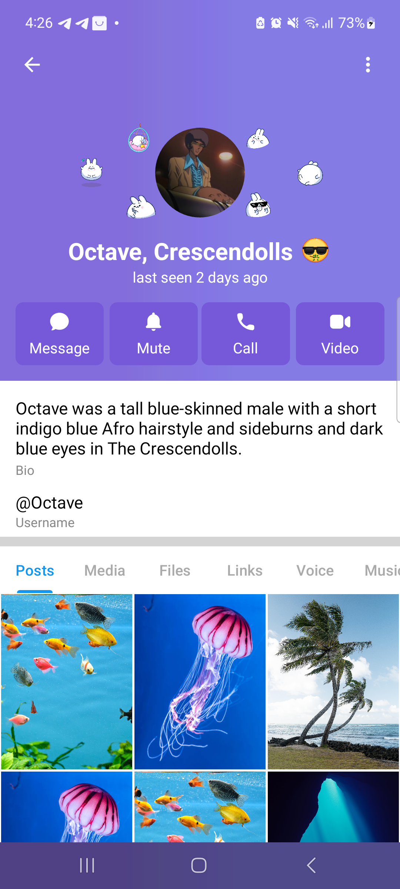

# 🧪 Telegram-Inspired Profile Screen (XML + Java)

## 🚀 What is this?

A custom implementation of a Telegram-style profile screen — built completely from scratch using **XML**, **Java**, and **a lot of improvisation**.

I didn’t have the hardware to build Telegram Android from source, so I decided to recreate the profile UI on my own — animations, scroll behavior, sticker views, and all.

---

## 📸 Demo

<table>
  <tr>
    <td></td>
    <td></td>
  </tr>
  <tr>
    <td align="center"><b>Collapsed</b></td>
    <td align="center"><b>Uncollapsed</b></td>
  </tr>
</table>

---

## 🧠 How it works

- **Scroll listener** detects vertical movement and triggers view animations
- **ObjectAnimator** handles opacity, scale, and translation for collapsing/expanding
- **Radians + sin/cos** place `ImageView`s evenly around a circle